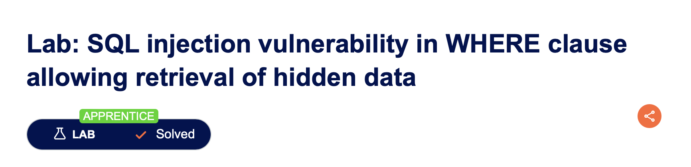
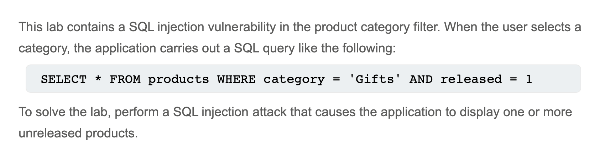

# SQL injection vulnerability in WHERE clause allowing retrieval of hidden data

---

## Executive Summary

During a controlled assessment of the demo web store provided by PortSwigger (“SQL Injection in `WHERE` clause – retrieve hidden data” lab), we confirmed that an attacker can manipulate the site’s product-filtering feature and force the database to return *all* records—including items the business meant to keep private.
Put simply, the application trusts text taken straight from the web address (URL) and passes it to the database without checking it. By subtly altering that text, we could **bypass the “show-only-released-items” safety check** and view every product in the catalogue.

---

## Description

---

## Why This Matters to You

* **Data exposure:** Hidden or unreleased products, prices or SKUs can leak to competitors or the public.
* **Customer trust:** If attackers can pull hidden data, they may also pivot to extract sensitive customer information.
* **Regulatory impact:** Unauthorised data disclosure may breach privacy or consumer-protection laws.

---

## Step-by-Step Walk-Through

*(Jargon kept minimal—technical terms are boxed and explained in plain language.)*

| # | What we did                                                                                                             | What the application tried to do                                                                                                | What actually happened & why                                                                                                                                                                |
| - | ----------------------------------------------------------------------------------------------------------------------- | ------------------------------------------------------------------------------------------------------------------------------- | ------------------------------------------------------------------------------------------------------------------------------------------------------------------------------------------- |
| 1 | **Established a baseline** by visiting `/filter?category=Gifts` (no tricks).                                             | Database runs a normal search: `SELECT * FROM products WHERE category='Pets' AND released=1`                                    | Page shows **3 released pet products**—exactly as expected.                                                                                                                                 |
| 2 | **Neutralised the safety check**. We added a short “comment” symbol recognised by databases: `/filter?category=Gifts'--` | Intended query still tacks on `AND released=1`, but everything after the `--` is ignored (the database treats it as a comment). | Query becomes `SELECT * FROM products WHERE category='Gifts'-- ' AND released=1` ⇒ the **released-only rule is now skipped**. The page shows **4 products** (including one unreleased item). |
| 3 | **Removed the category filter altogether**. We supplied `/filter?category=Gifts' OR 1=1--`                               | The `OR 1=1` condition is always true, so the database thinks *every* row matches.                                              | Final query: `SELECT * FROM products WHERE category='Gifts' OR 1=1-- ' AND released=1` ⇒ the site lists **every single product**, regardless of category or release status.                  |

> URL-encoded payload for (`Gifts' OR 1=1--`)
---

## Observable Output

| Test                              | Visible result            | What it proved                       |
| --------------------------------- | ------------------------- | ------------------------------------ |
| Baseline (`Gifts`)                 | 3 items                   | Normal operation.                    |
| Bypass released check (`Gifts'--`) | 4 items                   | Hidden/unreleased items now visible. |
| Show all (`Gifts' OR 1=1--`)       | 12 items (all categories) | Full catalogue disclosure confirmed. |

---

## Conclusion

The demonstration shows how a simple, one-line tweak to a URL can undo critical business logic and expose private inventory. 

